# Android Social Network App

A mini social networking application built for Android as an academic project.  
The app focuses on core social media features such as authentication, posting content, user interactions, and real-time notifications.

## Features

- User registration and login with email OTP verification
- JWT authentication with Access Token & Refresh Token
- Create posts with text, images, and videos
- Like, comment, reply to posts
- Follow / unfollow users
- Save and share posts
- Privacy control for posts (public / followers / private)
- Real-time notifications using Socket.IO
- User profile management
- Search users and posts
- Forgot password with email OTP

## Tech Stack

### Android Client
- **Kotlin**
- **Jetpack Compose**
- **MVVM Architecture**
- Retrofit & OkHttp
- Kotlin Coroutines & Flow

### Backend (Integrated)
- RESTful API
- JWT Authentication
- Socket.IO for real-time events

### Database & Services
- PostgreSQL
- Cloudinary (image & video storage)

## Architecture

The application follows the **MVVM (Model - View - ViewModel)** pattern:

- **UI Layer**: Jetpack Compose screens and reusable components
- **ViewModel Layer**: UI state management and business logic
- **Data Layer**: Repositories, API services, and network handling

Token refresh is handled automatically using an OkHttp Authenticator.

## Main Screens

- Login / Register
- Email OTP Verification
- Home Feed (Pagination)
- Post Details & Comments
- Create New Post
- User Profile
- Notifications
- Search

## Purpose

This project was developed to practice building a real-world Android application, covering:

- Secure authentication flows
- REST API integration
- Real-time communication
- Clean architecture and scalable code structure

## Future Improvements

- Real-time chat (1-1 and group)
- Admin dashboard for moderation
- Offline caching and feed optimization
- Content moderation and spam protection
- Recommendation system for posts

## License

This project is for **learning and academic purposes**.

## Screenshots

### Authentication
| Welcome | Login | Register (Email) | OTP Verification |
|--------|-------|------------------|------------------|
| 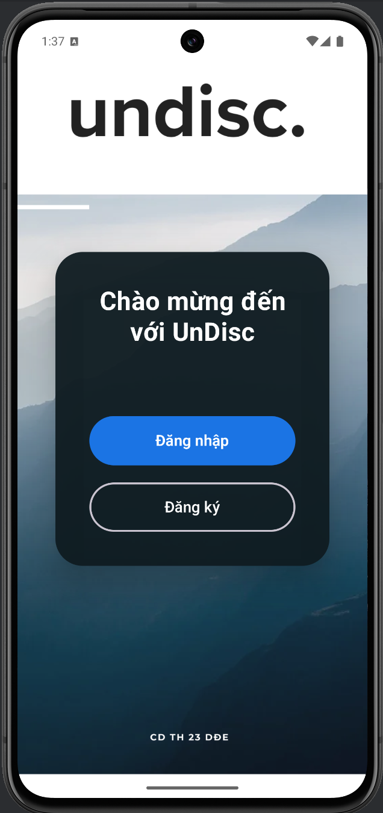 | 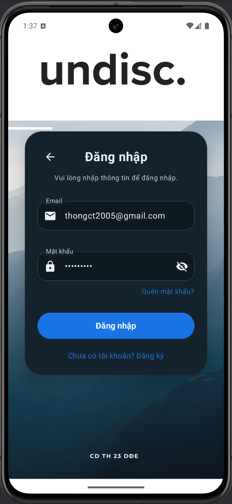 | 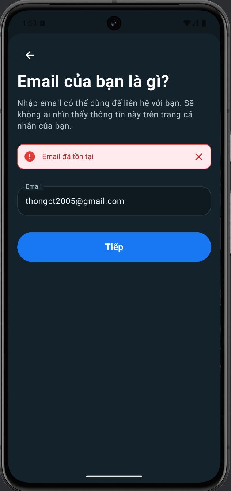 | 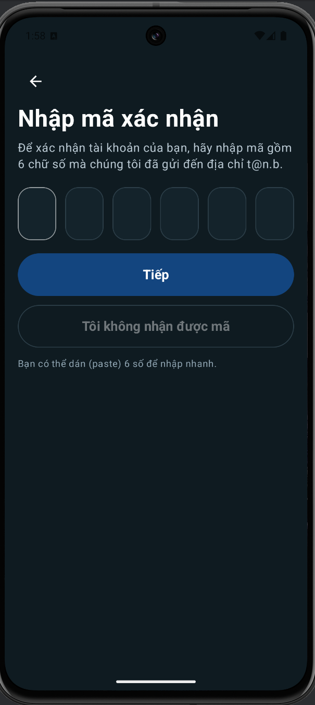 |

### Home & Feed
| Feed | Create Post | Post Detail |
|------|-------------|-------------|
| 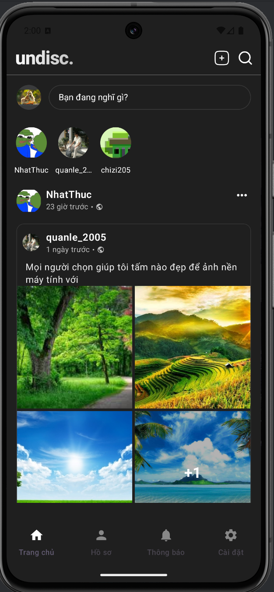 | 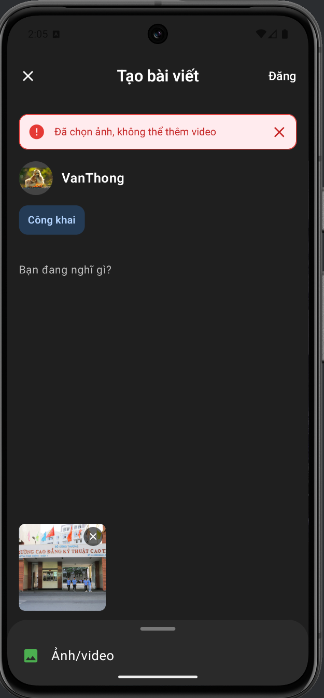 | 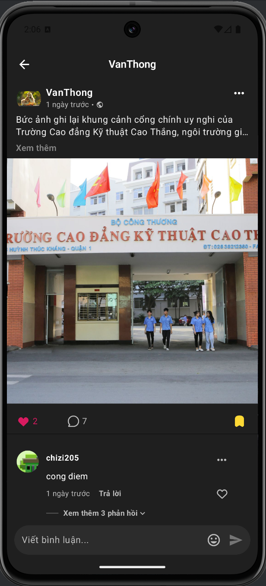 |

### Post Interaction
| Comment | Empty Comment | Share |
|---------|---------------|-------|
| 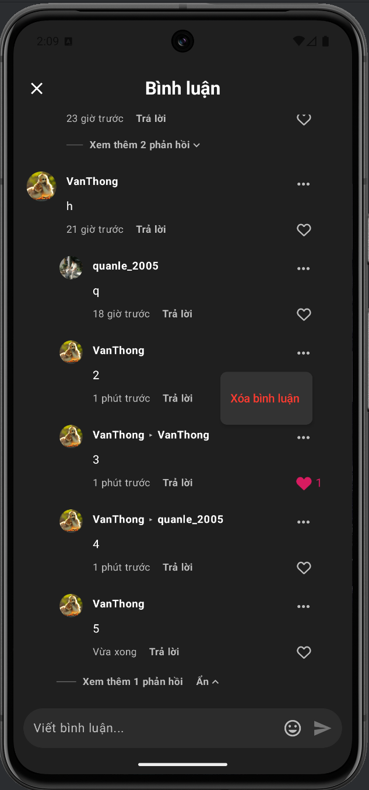 | 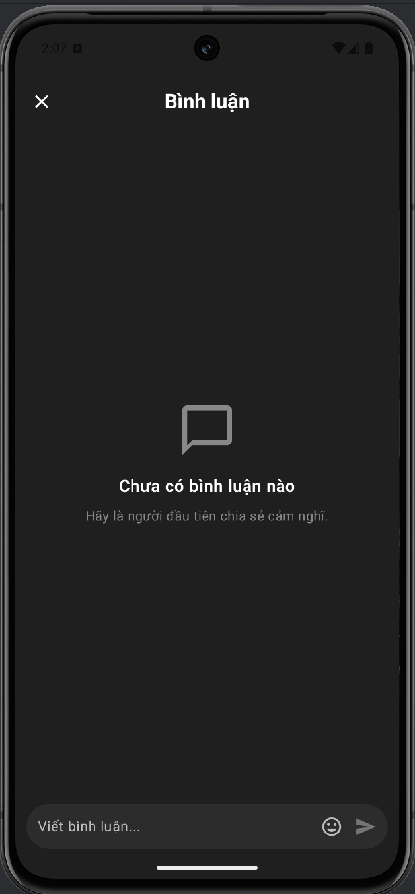 | 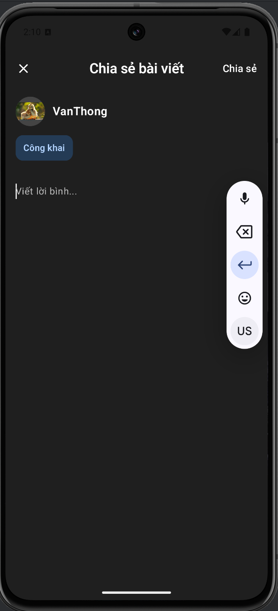 |

### Profile
| Profile Posts | Saved Posts | Edit Profile |
|---------------|-------------|--------------|
| 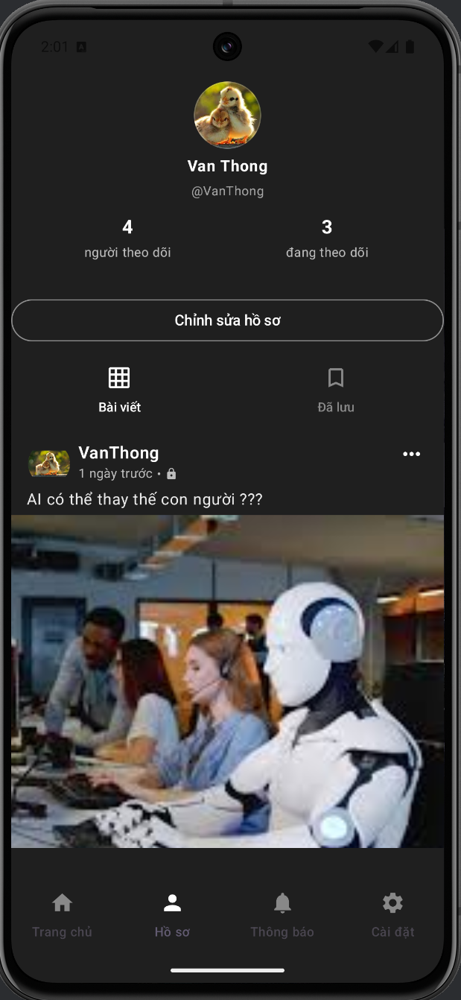 | 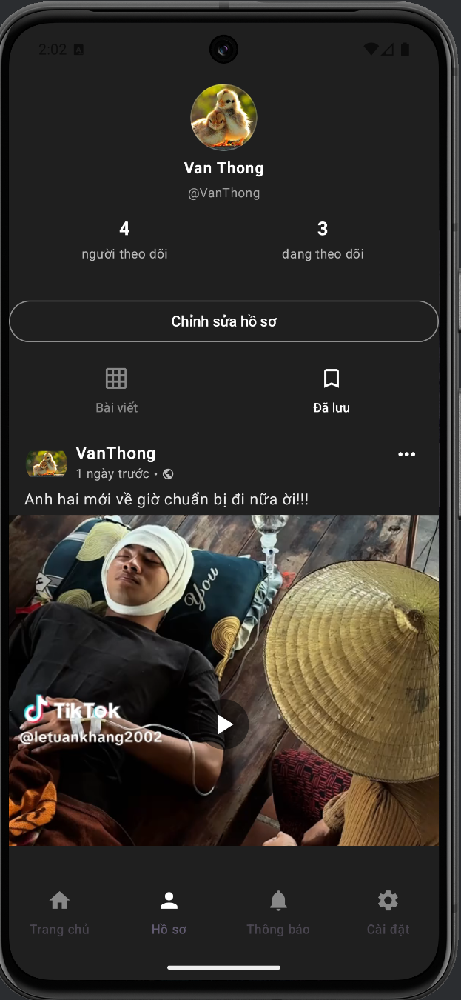 | 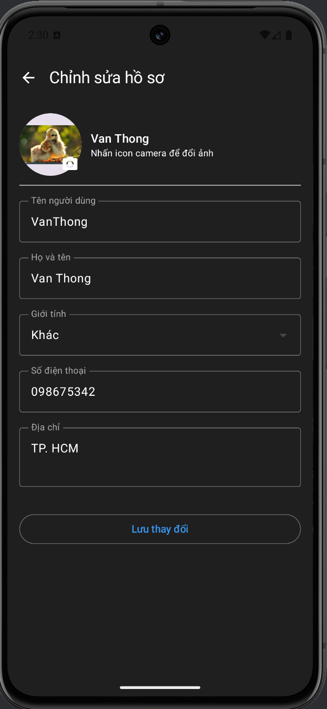 |

### Follow
| Followers | Following |
|-----------|-----------|
| 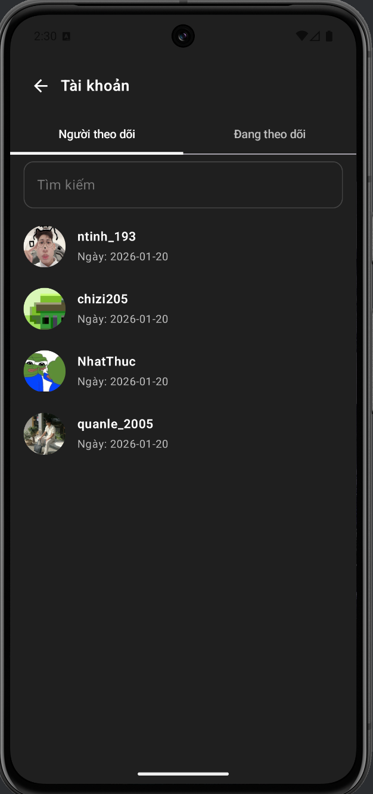 | 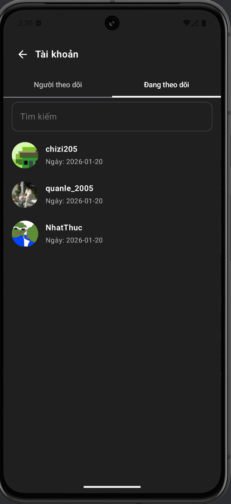 |

### Search
| Search | Search User | Search Post |
|--------|-------------|-------------|
|  | 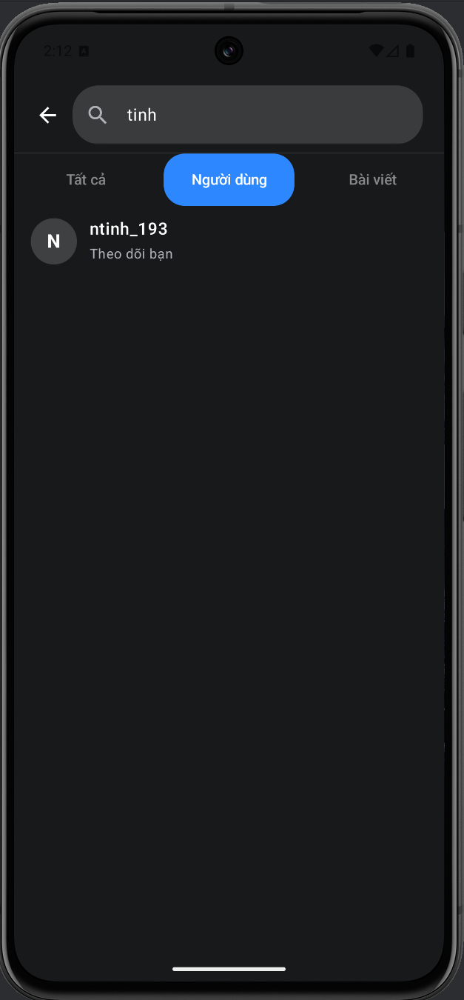 |  |

### Notifications
| All Notifications | Unread Notifications |
|-------------------|---------------------|
| 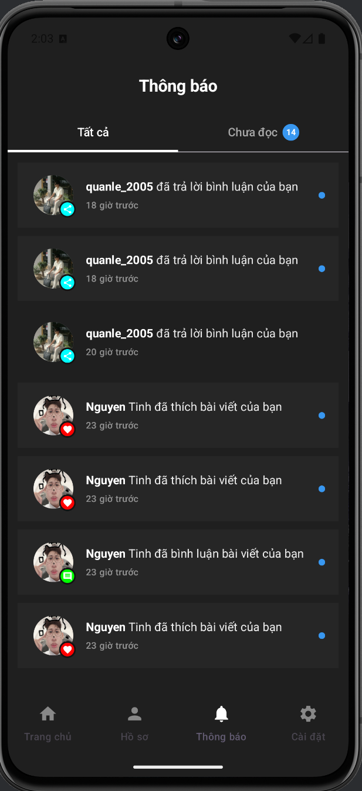 | 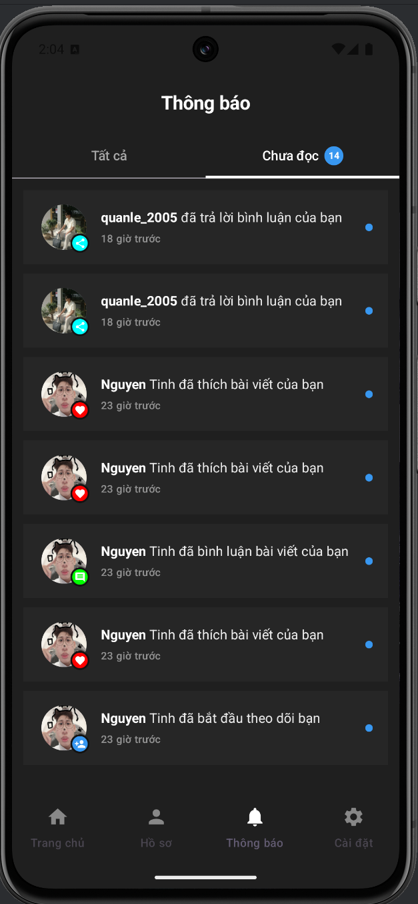 |

### Media
| Image Detail | Video Detail |
|--------------|--------------|
| 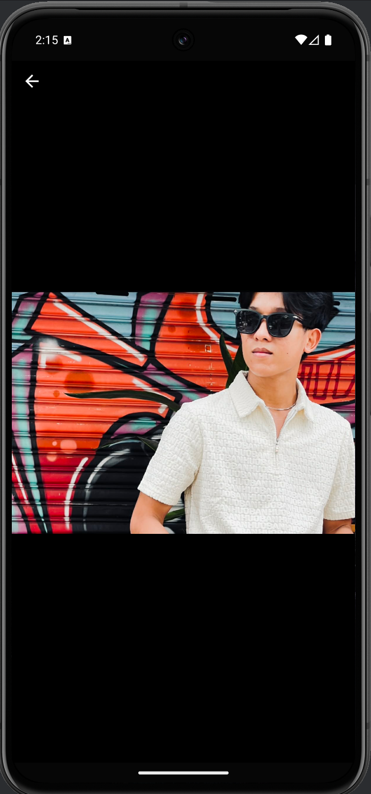 | 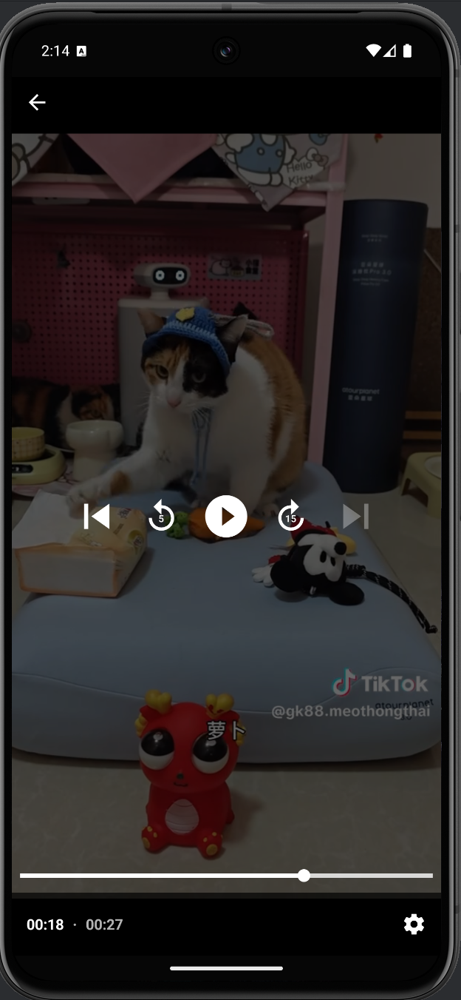 |

### Settings
| Settings |
|----------|
| 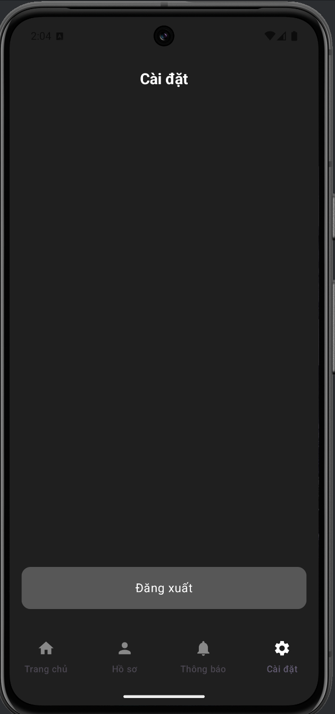 |

